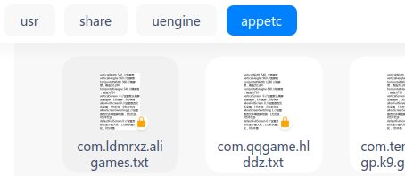

# 更多
## Linux 和 Windows 时间不同步
:::tip 出处
见 [https://bbs.deepin.org/post/253670?postId=1438866](https://bbs.deepin.org/post/253670?postId=1438866) 3楼。
:::
###  一、 Windows的时间和时区

Windows操作系统直接把CMOS时间认定为当前显示时间，不根据时区转换。这样每调整一次系统时区，系统会根据调整的时区来计算当前时间，确定后，也就同时修改了CMOS内的时间（即每调整一次时区，设置保存后，CMOS时间也将被操作系统改变一次，注意不同操作系统调整时间后，也会同时改变CMOS时间，这一点是共通的）。

### 二、 Linux的时间和时区

Linux和苹果操作系统以当前主板CMOS内时间做为格林威治标准时间，再根据系统设置的时区来最终确定当前系统时间（如时区设置为GMT+08:00北京时间时以及当前CMOS时间为03:00，那么系统会将两个时间相加得出显示在桌面的当前系统时间为11:00）

### 三、 问题解决

解决的办法有两个

让Windows使用Ubuntu的时间管理方式，就是启用UTC（世界协调时）
让Ubuntu按照Windows的方式管理时间，就是让Ubuntu禁用UTC（世界协调时）

个人建议第二种，因为通常Windows是主系统，不推荐对Windows进行这种修改，不过我还是都介绍一下：
1.在Windows下启用UTC
打开运行窗口（快捷键Win+R），然后输入regedit启动注册表编辑器，并找到一下目录位置：
```
HKEY_LOCAL_MACHINE/SYSTEM/CurrentControlSet/Control/TimeZoneInformation/
```
添加一项类型为`REG_DWORD`的键值，命名为`RealTimeIsUniversal`，值为 `1` 然后重启后时间即回复正常

2.在Linux下关闭UTC
这个用这个方法是我比较推荐的：按Ctrl+Alt+T调出终端，输入：
```
sudo vim /etc/default/rcS
```
找到
```
UTC=yes
```
这一行，改成
```
UTC=no
```
保存即可，时间修改立即生效。这样就可以解决Windows与Ubuntu双系统时间同步问题了

3.(推荐)

在Linux下打开终端，输入命令：
```
timedatectl set-local-rtc 1
```
然后再输入
```
timedatectl
```

## 清理不需要的系统内核（待斟酌）
:::tip 出处
见 [https://bbs.deepin.org/post/253636?postId=1438575](https://bbs.deepin.org/post/253636?postId=1438575) 2楼。
:::
查询当前系统的全部内核
```
sudo dpkg -l|egrep "linux-header|linux-image"
``` 

清理不需要的内核
```
sudo apt purge xxxxx
```

## 删除文件管理器“磁盘”中的百度网盘快捷方式
删除`/usr/share/dde-file-manager/extensions/appEntry`目录下的 .desktop 文件。

## 自定义屏幕缩放
:::tip 出处
见 [https://bbs.chinauos.com/zh/post/9328](https://bbs.chinauos.com/zh/post/9328) 2楼。
:::
执行命令`sudo apt install dconf-editor`安装 dconf editor 并打开它，找到`window-scale`这一项进行修改。

## 放大镜
:::tip 出处
见 [https://bbs.deepin.org/post/253561?postId=1438805](https://bbs.deepin.org/post/253561?postId=1438805) 回复。
:::
Super + +，启用放大镜；

Super + -，缩小放大镜；

Super + 0，关闭放大镜。

## 加入内测后部分软件安装出现问题
:::tip 出处
见 [https://bbs.deepin.org/zh/post/254022?postId=1442273](https://bbs.deepin.org/zh/post/254022?postId=1442273) 7楼。
:::
执行 
```
sudo rm /var/lib/apt/lists/*
sudo apt update
```
更新本地仓库索引信息，再重新尝试安装。


## 调整安卓应用的宽高、默认横屏等显示参数
:::tip 出处
见 [https://bbs.deepin.org/zh/post/254022?postId=1442273](https://bbs.deepin.org/zh/post/254022?postId=1442273) 2楼。
:::
配置文件位置：/usr/share/uengine/appetc，每一个文件对应一个安卓应用，文件名是应用ID



文件内容很简单：
```
verticalWidth 540 //竖屏宽
verticalHeighe 960 //竖屏高
horizontaltWidth 1280 //横屏宽，备选为1280
horizontaltHeighe 640 //横屏高 ，备选为720
verticalScreen 0 //设置默认横屏还是竖屏，1为竖屏，0为横屏
allowFullScreen 0 //设置是否允许全屏，1为允许，0为不允许
allowScreenSwitching 1 //设置是否允许横竖屏切换，1为允许，0为不允许
defaultFullScreen 0 //设置是否默认显示最大化，1为默认最大化，0为不是
```

## 清除文件管理器的地址栏历史
:::tip 出处
见 [https://bbs.deepin.org/post/254424?postId=1445509](https://bbs.deepin.org/post/254424?postId=1445509) 3楼。
:::
打开`~/.config/deepin/dde-file-manager/dde-file-manager.obtusely.json`，删除其中的`SearchHistory`项。

## 检查应用的开机启动情况
:::tip 出处
见 [https://bbs.deepin.org/post/253444](https://bbs.deepin.org/post/253444)。
:::
检查

systemctl list-unit-files

service --status-all

/etc/xdg/autostart 目录下

##  bash: cd: 参数太多
:::tip 出处
见 [https://bbs.deepin.org/post/254318](https://bbs.deepin.org/post/254318) 回复。
:::
如果是输入的路径中含有空格等特殊字符，需在相应文件夹名称的两侧加上`'`，如`.../'deepin 常用资源整理'/...`。

## 论坛 Markdown 编辑器`< >`符号未按原文显示
:::tip 出处
见 [https://bbs.deepin.org/post/254090?postId=1442569](https://bbs.deepin.org/post/254090?postId=1442569) 6楼。
:::
由于`<`符号在markdown和html中都有特殊含义，可以用`把网址包裹起来。

比如

`git clone https://<gitee_用户名>:<私人令牌>@gitee.com/<gitee_用户名>/notepad.git`

## 隐藏 Wayland 入口
:::tip 出处
见 [https://bbs.deepin.org/post/256684?postId=1466134](https://bbs.deepin.org/post/256684?postId=1466134) 6楼。
:::
终端执行 `dde-dconfig -a org.deepin.dde.lightdm-deepin-greeter -r org.deepin.dde.lightdm-deepin-greeter -k allowSwitchingToWayland --set -v false`。
​
