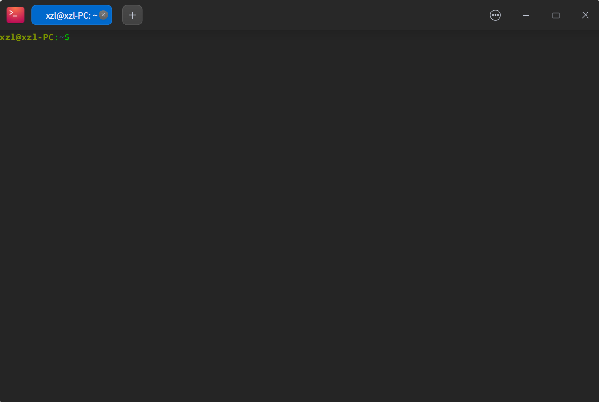
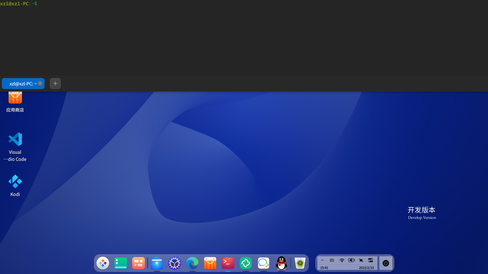

# 1.1. 控制台基础

## 1.1.1. shell 提示符

启动系统后，当你看到登陆界面时，按Ctrl+Alt+F2就可以切换到tty2进行登陆，假设你的主机名为`foo`，那么登录提示符将如下所示。（如果是非标准键盘用户，可能需要同时按下fn键）

```Shell
Deepin GNU/linux 23 foo tty2
foo login：
```

你需要在login：后面输入你的用户名  然后回车

此时，登陆提示符显示如下：

```Shell
Password：
```

输入用户密码即可。

:::tip
请注意，密码并不会被显示，不要怀疑自己是否输入了密码。
:::

遵循 Unix 传统，deepin 系统下的用户名和密码是大小写敏感的。用户名通常由小写字母组成。第一个用户账号通常在安装期间进行创建。额外的用户账号由 root 用户用 adduser(8) 创建。

系统以保存在 "`/etc/motd`" 中的欢迎信息（Message Of The Day）来开始，同时显示一个命令提示符

```Shell
Linux foo-PC 5.18.17-amd64-desktop-hwe #23.01.00.06 SMP PREEMPT_DYNAMIC Mon Oct 31 17:25:49 CST 2022 x86_64
Welcome to Deepin V23 GNU/Linux

    * Homepage:https://www.deepin.org/

    * Bugreport:https://bbs.deepin.org/
```

你可以用root权限来修改此文件来达到自定义的目的

此时你就在shell下了，你可以在shell下尝试与电脑交流。

如果你想回到图形界面。请按Ctrl+Alt+F1，即可切换回GUI

约定：GUI表示图形界面

## 1.1.2. GUI 下的 shell 提示符

deepin预装了GUI环境，并且提供终端模拟器：deepin-terminal,你可以按Ctrl+Alt+T打开它，或者通过开始菜单打开它，如下：



关于终端的其他介绍，见deepin wiki ，此处不再赘述。

## 1.1.3. root 账户

root 账户也被称作超级用户或特权用户。用这个账户，你能够履行下面的系统管理任务。

- 读、写和删除系统上的任何文件，不顾它们的文件权限

- 设置系统上任何文件的所有者和权限

- 设置系统上任何非特权用户的密码

- 免用户密码登录任何帐户

无限权力的 root 账户，要求你慎重和负责任的使用。

::: warning
注意：如果有人告诉你形如：`sudo rm -rf /*` ，请谨慎对待，最好你在执行此命令之前了解此命令含义，否则会造成不可挽回的后果。
:::

一个文件（包括硬件设备，如 CD-ROM 等，这些对 Linux 系统来说都只是一个文件）的权限可能会导致非 root 用户无法使用或访问它 。虽然在这种情况下，使用 root 帐户是一个快速的方法，但正确的解决方法应该是对文件权限和用户组的成员进行合适的设置（参见第[1.2.3 节 “文件系统权限](./1.2.%E7%B1%BBUnix%E7%B3%BB%E7%BB%9F.md))”）。

## 1.1.4. root shell 提示符

这里有一些基本的方法可以让你在输入 root 密码后获得 root的 shell 提示符。

- 在字符界面的登录提示符，键入 root 作为用户名登录。

- 在任意用户的 shell 提示符下输入“su -l”。

  这不会保存当前用户的环境设定。

- 在任意用户的 shell 提示符下输入“su”。

  这会保存当前用户的一些环境设定。

注意：任何情况都不建议使用root用户直接登陆，而是使用sudo+命令方式

## 1.1.5. 虚拟控制台

在默认的 deepin系统中，有6个可切换的类VT100字符控制台，可以直接在 Linux 主机上启动 shell。GUI界面占据tty1。

如果你已经在字符控制台中 你可以同时按下左Alt键和F2—F6之一的键在虚拟控制台间切换。每一个字符控制台都允许独立登录账户并提供多用户环境。这个多用户环境是伟大的 Unix 的特性，很容易上瘾。

如果你处于 GUI 环境中，你可以通过 Ctrl-Alt-F3 键前往字符控制台 3，也就是同时按下左 Ctrl 键、左 Alt 键和F3 键。你可以按下 Alt-F1 回到 GUI 环境，它一般运行在虚拟控制台 2。

你也可以使用命令行切换到另一个虚拟控制台，例如切换到控制台 3

```Shell
sudo chvt 3
```

## 1.1.6. 雷神终端

这是deepin的特有功能，在GUI界面下按Alt+F2唤出，和普通终端一致。快捷键可以在控制中心修改。

雷神终端将始终置顶。



这是一种快捷调出终端的方式，并且调出的终端一直存在于后台，直到你显式退出（exit）

## 1.1.7. 怎样退出命令行提示符

同时按下`左侧Ctrl键`和`D键`，即可关闭 shell 活动。如果你正处于字符控制台，你将会返回到登录提示行。你也可以键入 ”`exit`" 退出命令行。

如果你位于`x终端模拟器`中，你可以使用这个关闭`x 终端模拟器`窗口。

## 1.1.8. 怎样关闭系统

就像任何其他的现代操作系统一样，deepin 会通过内存中的[缓存数据](https://zh.wikipedia.org/wiki/%E7%BC%93%E5%AD%98)进行文件操作以提高性能，因此在电源被安全地关闭前需要适当的关机过程，通过将内存中的数据强制写入硬盘来维持文件的完整性。如果软件的电源控制可用，那么关机过程中会自动关闭系统电源。（否则，你可能需要在关机过程之后按电源键几秒钟：相当于强制关机）

在普通多用户模式模式下，可以使用命令行关闭系统。

```Shell
sudo shutdown -h now
```

在单用户模式下，可以使用命令行关闭系统。

```Shell
sudo poweroff -i -f
```

参见[第 6.3.8 节 “怎样通过 SSH 关闭远程系统”](https://www.debian.org/doc/manuals/debian-reference/ch06.zh-cn.html#_how_to_shutdown_the_remote_system_on_ssh)。

## 1.1.9. 恢复一个正常的控制台

当做了一些滑稽的事（例如“`cat二进制文件`”）后，屏幕会发狂，你可以按Ctrl+C来取消当前命令。你也可以输入“`clear`”来清屏。

## 1.1.10. 建议新手安装的额外软件包

deepin作为一个开箱即用的系统，已经预装了许多软件包，但是依然有些软件包是值得被推荐的：

|||
|-|-|
|htop|一个更高级的top|
|neovim|更好用的vim,前提是你会配置|
|tree|展示文件树|

你可以用下面的命令安装这些包。

```Shell
sudo apt-get install <package_name>
```

## 1.1.11. 额外用户账号

如果你不想用你自己的主用户账户来进行下面的练习操作，你可以使用下面的方式创建一个练习用户账户，比如说，创建一个用户名为 `fish` 的账号。

```Shell
sudo adduser fish
```

回答所有问题。

这将创建一个名为 `fish` 的新账号。在你练习完成后，你可以使用下面的命令删除这个用户账号和它的用户主目录。

```Shell
sudo deluser --remove-home fish
```

## 1.1.12. sudo 配置

对于典型的单用户工作站，例如运行在笔记本电脑上的桌面 deepin 系统，通常简单地配置 `sudo`(8) 来使为非特权用户（例如用户 `penguin`）只需输入用户密码而非 root 密码就能获得管理员权限。

```Shell
sudo echo "penguin  ALL=(ALL) ALL" >> /etc/sudoers
```

另外，可以使用下列命令使非特权用户（例如用户 `penguin`）无需密码就获得管理员权限。

```Shell
sudo echo "penguin  ALL=(ALL) NOPASSWD:ALL" >> /etc/sudoers
```

这些技巧只对你管理的单用户工作站中那个唯一的用户有用。

在多用户工作站中不要建立这样的普通用户账户，因为它会导致非常严重的系统安全问题。

在上述例子中，用户 penguin 的密码及账号要有和 root 账号密码同样多的保护。

  在这种情况下，管理员权限被赋予那些有权对工作站进行系统管理任务的人。永远不要让你的公司行政管理部门或你的老板进行管理（例如给予他们权限），除非他们获得了授权并有这样的能力。

为了对受限的设备和文件提供访问权限，你应该考虑使用组来提供受限访问，而不是通过sudo(8)来使用 root权限。

  随着越来越细致周密的配置，sudo(8) 可以授予一个共享系统上的其它用户有限的管理权限而不共享 root 密码。这可以帮助对有多个管理员的主机进行责任追究，你可以了解到是谁做什么。另一方面，你可能不想任何人有这样的权限。

## 1.1.13. 动手时间

现在你已经准备好在 deepin 系统上开工了，只要你使用非特权用户账号就不会有风险。

这是因为 deepin系统（即使是默认安装）会设置适当的文件权限来防止非特权用户对系统造成破坏。

我们使用下面的方式，把 deepin 系统当作一个 类 Unix 系统来学习。

第 1.2 节 “类 Unix 文件系统” (基本概念)

第 1.4 节 “类 Unix 工作环境基础” (基本方式)

第 1.5 节 “简单 shell 命令” (shell 机制)

第 1.6 节 “类 Unix 的文本处理” (文本处理方式)
