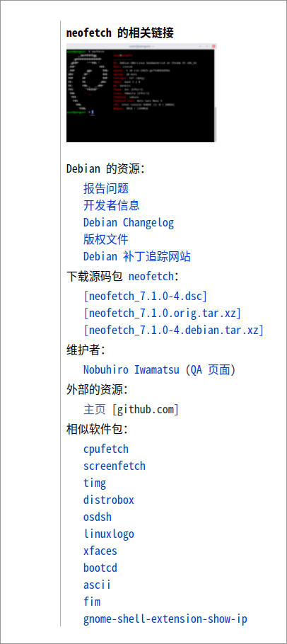

# 为deepin添加来自debian或者ubuntu的软件包

目前deepin v23需要自行维护软件源，如果你想要添加来自Debian或者ubuntu的软件包，可以参考下面的方法。

::: warning
不要从任何的混合源中安装软件包。它可能会打破软件包的一致性，这需要你要深厚的系统管理知识，例如 ABI 编译器、库版本和解释器特性等等。
:::

## 从debian添加软件包

### 1. 寻找合适的软件包

这里以neofetch为例子，首先在debian的软件包列表中搜索neofetch，找到对应的软件包，这里是`neofetch`。

1. 在此网站中搜索软件包[debian packages search](https://packages.debian.org/index)

2. 选择合适的软件包：deepin v23 是从debian11开始转向上游维护的，所以可以选择debian11以及以上的软件包，但是不建议选择unstable的软件包。同时需要注意，需要选择正确的架构，这里是amd64。

3. 下载软件包对应的源码包：在web页面右侧下载源码包栏目内，选择对应的源码包，这里是`neofetch_7.1.0-1.dsc`，鼠标右键复制链接地址，打开终端，选择一个合适的目录，使用dget命令下载源码包

    

```shell
dget 来自devscripts工具包可以同步下载orig等压缩包，终端进行安装 apt install devscripts
dget  https://deb.debian.org/debian/pool/main/n/neofetch/neofetch_7.1.0-1.dsc
```

 同栏目的其他文件会被同步拉取，这里是`neofetch_7.1.0.orig.tar.xz`和`neofetch_7.1.0-1.debian.tar.xz`。

### 2. 解压源码包

```shell
dpkg-source -x neofetch_7.1.0-1.dsc
```

你可以获得一个`neofetch-7.1.0`的目录，进入目录，可以看到`debian`目录，这个目录就是debian的源码包。
:::tip
注意检查源码中是否包含发行版的判断，比如debian/rules、CMakeList 等构建时的判断检查等
:::

### 3. 检查依赖

```shell
进入源码目录执行，dpkg-checkbuilddeps
```

shell会提示你缺少哪些依赖，这里是`dh-autoreconf`，使用apt安装即可。

```shell
sudo apt install dh-autoreconf
```

部分依赖源内有，但是需要检查一下版本是否满足要求。如果不满足，则需要对依赖包进行打包。（重复上述步骤）

### 4. 打包

建议使用pbuild/sbuild进行打包验证，详情参考[sbuild](https://wiki.ubuntu.com/SimpleSbuild)  [pbuilder](https://wiki.ubuntu.com/PbuilderHowto)，这些打包工具可以更方便帮助打包且不污染宿主机环境，但是请注意这里我们默认您有一些基础的知识，如仓库的添加，编写基础的脚本。打包完成后您会得到对应的deb包，下面可以进行安装

### 5. 安装

```shell
sudo dpkg -i neofetch_7.1.0-1_amd64.deb // [!code  error]
```

上述操作是错误的，还记得我们之前的提示吗，不要使用`dpkg -i`安装软件包，这里我们使用`apt install`安装。

```shell
sudo apt install ./neofetch_7.1.0-1_amd64.deb
```

apt会自动解决依赖关系，安装完成后，可以使用`neofetch`命令查看效果。

## 从ubuntu添加软件包

和Debian类似，ubuntu也有一个软件包搜索网站：
[packages.ubuntu.com](https://packages.ubuntu.com/)
在这里搜索软件包，剩下的步骤和Debian类似。

## 从其他源添加软件包

如果你想要添加来自其他源的软件包，可以参考上述步骤，但是需要注意的是，其他源的软件包可能会有一些不兼容的问题，需要自行解决。

## 为deepin 贡献来自其他发行版的软件包

如果你想要为deepin贡献来自其他发行版的软件包，可以参考上述步骤，进行打包安装验证，确定没有问题后，可以提交到deepin-community仓库，deepin社区会进行审核，审核通过后，会合并到deepin仓库中。

::: tip
建议软件包来源为Debian或者自己打包的软件包，这样可以保证软件包的一致性。
:::

具体要求在[deepin-wiki](https://wiki.deepin.org/zh/01_deepin%E9%85%8D%E5%A5%97%E7%94%9F%E6%80%81/01_deepin%E5%85%A5%E9%97%A8/02_%E5%BC%80%E5%8F%91%E7%9B%B8%E5%85%B3/02_%E8%B4%A1%E7%8C%AE%E6%8C%87%E5%8D%97/deepin-community%E5%8D%8F%E4%BD%9C%E6%B5%81%E7%A8%8B)
